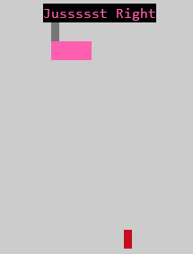
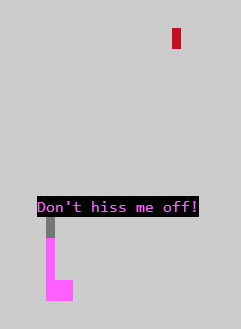

# 🐍 Snake Client Project

Snake game is a very popular video game. It is a video game concept where the player maneuvers a dot and grows it by ‘eating’ pieces of food. As it moves and eats, it grows and the growing snake becomes an obstacle to smooth maneuvers. The goal is to grow it to become as big as possible without bumping into the side walls, or bumping into itself, upon which it dies.

This is simply a multiplayer take on the genre.

## Purpose

This repository contains all the Snake Client project files completed by [Diana](https://github.com/dialop/snake-client) for the Lighthouse Labs Web Developnment Flex Program Bootcamp.

Before you can run this client, you will need to be running the server side which you can download and install below:

## Final Product

 

## Getting Started

### Install it:

#### Step 1: Clone the server [snek-multiplayer](https://github.com/lighthouse-labs/snek-multiplayer.git):

```bash
- git clone git@github.com:lighthouse-labs/snek-multiplayer.git

- cd snek-multiplayer

- npm install

- npm run play
```

#### Step 2: Clone the client [snake-client](git@github.com:dialop/snake-client.git):

```bash
- npm install @dialop/snake-client


- cd snake-client

- npm install

- npm run play
```

#### Open another terminal command and proceed with the following:

- Run the snake client using the `npm run play` command

#### Use the following keys on keyboard to navigate the game

| Key        | Command                                    |
| ---------- | ------------------------------------------ |
| `w`        | sends move up command                      |
| `a`        | sends move left command                    |
| `s`        | sends move down command                    |
| `d`        | sends move right command                   |
| `1`        | sends canned message " Don't hiss me off!" |
| `2`        | sends canned message" Jussssst Right "     |
| `CTRL + C` | exit the game                              |

- The goal of this game is to eat the red dots on the screen to gain points
- In order to stay alive in the game, avoid colliding into the snake tail or the walls

## Acknowledgements

This project was not built from scratch. It was inspired and started from [snek](https://github.com/taniarascia/snek) ([blog post](https://www.taniarascia.com/snake-game-in-javascript/)). [Tania Rascia](https://www.taniarascia.com) is the original author.
